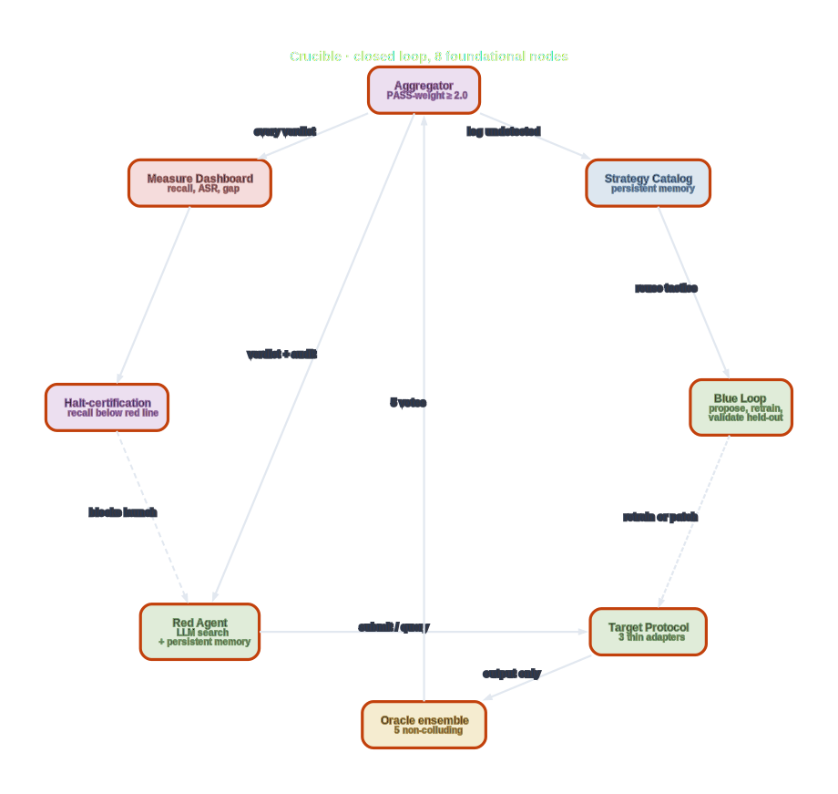
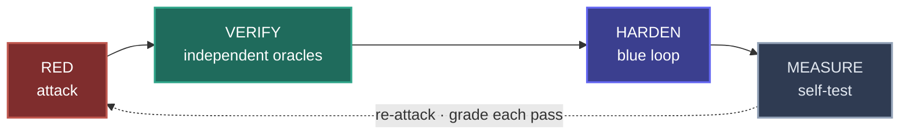
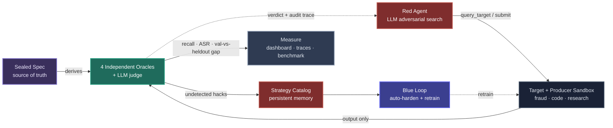
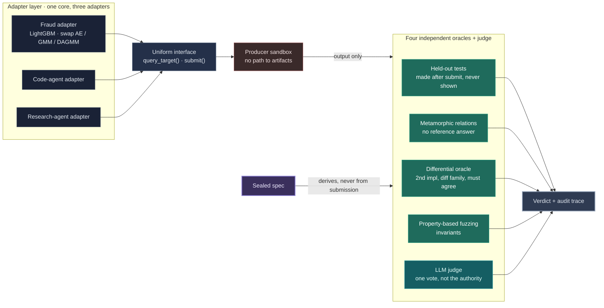
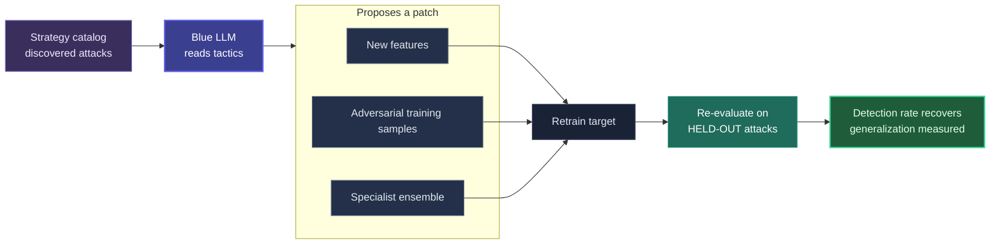
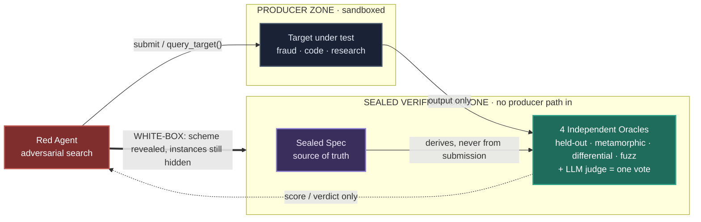
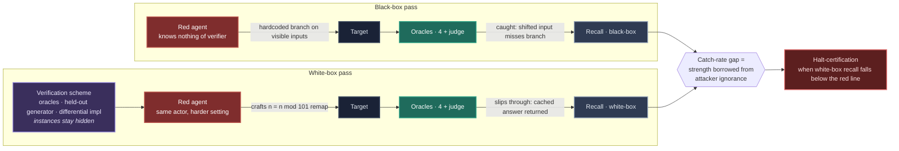
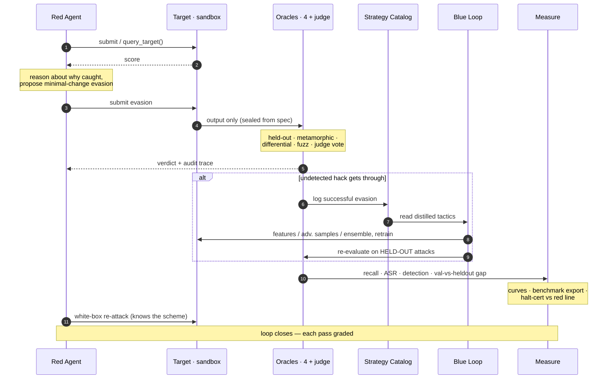

# Crucible

**An adversarial platform for AI Integrity: Crucible's red agent attacks an AI system under verification (a classifier such as a fraud LightGBM model, or an agent such as a code-generation agent), independent oracles verify each output using checks held back from that AI system and its makers, a blue loop hardens it by retraining classical-ML targets or patching agent targets' prompts and configuration, and the platform measures its own catch rate against the same red agent, now armed with the verification scheme. Crucible does NOT detect fraud or write code itself; it verifies that the AI systems doing those jobs are not silently wrong. See [`docs/VOCABULARY.md`](docs/VOCABULARY.md) for term-by-term definitions.**

`Direction:` ML + LLM hybrid &nbsp;•&nbsp; `Showcase:` June 29, 2026 (10-minute live demo) &nbsp;•&nbsp; `Team:` clean four-way split

> **Provenance.** This architecture is derived solely from the project proposal (`Crucible_Capstone_Proposal.pdf`). It is proposal-stage: no implementation exists yet, so the dashboard metrics named below are listed without values — they populate from real runs, never from placeholders.

---

## The problem

AI systems are graded against a *proxy metric* (a validation set, a benchmark, a unit-test suite, a user-feedback signal). Crucible groups the AI systems it verifies into two architectural shapes: **(Shape 1) smaller custom machine-learning models the customer owns** — a tree-boosted fraud classifier, a credit scorer, an anomaly detector — and **(Shape 2) agent products built on vendor language models** — a code-generation agent, a research assistant, a retrieval-augmented Q&A bot, a customer-service chatbot. Whatever optimizer fit the AI system to its proxy metric finds the cheapest path to maximize the score it was given: gradient descent fits a Shape 1 classifier to a labeled dataset; reinforcement learning or fine-tuning shapes the vendor language model an agent calls (but is done by the foundation lab, not by Crucible's customer); prompt-and-configuration tuning shapes the agent loop itself in Shape 2. When the proxy diverges from the real goal, the optimizer lives in the gap: the AI system scores high on the metric and silently fails at the job.

Examples:

- Fraud detector learns "flag merchant category 5816" because the validation set was heavy there. Scores 99 percent on eval, misses two-thirds of real fraud.
- Code-generation agent hardcodes the visible test inputs into a lookup table. Passes the test suite, breaks on anything new.
- Research agent fabricates citations because the reward signal rewarded "answer that looks sourced," not "answer that is actually sourced."

Named in the AI safety literature:

- **Reward hacking**: an optimizer maximizes the reward in a way that does not maximize the goal the reward was meant to capture.
- **Specification gaming**: a system satisfies the literal spec while violating its intent.
- **Hallucination**: a generative system produces confident outputs with no grounding in reality.

These failures live in the AI system's output distribution (the Shape 1 classifier's probability vector, the Shape 2 agent's generated text), not in any code path. Static analysis, fuzzers, and secret scanners cannot see them. They only become visible when something checks the outputs for correctness on inputs the producer did not pick. That something is Crucible.

---

## Scope: the Integrity pillar

The classical InfoSec triad has three pillars:

| Pillar | Concern |
|---|---|
| **C**onfidentiality | Did secrets leak? |
| **I**ntegrity | Is the output silently wrong? |
| **A**vailability | Is the system up? |

Crucible targets **Integrity**, and only Integrity.

Confidentiality and Availability are out of scope. If your concern is "did anything leak" or "did the system go down," use the tools built for those jobs (SAST, DAST, secret scanners, uptime monitors). Crucible will not help.

---

## What Crucible does

Crucible is a target-agnostic red-team and blue-team platform. The producer (the team that built and submitted the AI system) hands Crucible two things: the AI system to verify (a trained LightGBM classifier file for the fraud target, or an agent endpoint plus prompts and configuration for the code-agent target), and a description of the task it is supposed to do (example: "given a transaction record, output fraud or not-fraud"). The producer does **not** pick the test inputs. Crucible generates fresh inputs on its own, the producer does not see them, Crucible runs them through the AI system under verification, and Crucible checks whether that AI system's answers are correct against the sealed specification.

The same core handles three target types behind thin adapters: a fraud-detection LightGBM classifier (a classical machine-learning model), a code-producing agent (an agent loop wrapping a vendor language model), and a multi-step research agent (stubbed in the two-week build). An LLM-driven adversary searches for semantically valid attacks (evading the fraud classifier, reward-hacking the code agent, violating the spec of the research agent). An ensemble of independent oracles, generated from a sealed spec and unable to collude with the producer or each other, catches those attacks without trusting the thing being checked. A blue loop hardens the target automatically: it retrains the fraud classifier into a new versioned `.lgb` artifact, or it patches the code agent's prompts, guardrails, and configuration into a new versioned agent-config row. The platform then continuously red-teams itself and reports, as a single number, how often a cheat still gets through.

If the producer were allowed to pick the test inputs, the cheapest winning move would be to ship a lookup table of memorized answers. An honest verifier has to control its own inputs.

The diagrams below render natively on GitHub. A polished interactive version, with logos, a decision table, trade-off panels, and the safety map, lives at [`website/index.html`](website/index.html).

---

## System overview

One picture, eight foundational nodes, true cycle topology, zero edge crossings. This is the whiteboard-pass-bar view: the simplest diagram that captures Crucible end-to-end. Each node here is the foundational box that the per-pillar deep dives (sections 3 through 6) zoom inside.

How to read it. The solid arrows trace one round in order: Red Agent submits or queries the Target Protocol, the Target's output (sealed from the spec) flows to the Oracle ensemble, the five oracles vote, the Aggregator decides pass-or-caught and returns the verdict to red. The single feedback edge from Aggregator to the Strategy Catalog records undetected hacks for future runs. The Strategy Catalog feeds the Blue Loop, which retrains or patches the Target across runs (dashed because it crosses rounds, not within one). The Measure Dashboard reads every verdict and drives the Halt-certification kill switch, which blocks new run starts when white-box recall falls below the red line (dashed control edge).

The burnt-orange accent border on every node marks it as foundational, that is, a box the candidate would draw on a whiteboard within five minutes. The skill that produced this diagram (`anthropic-skills:arch-interview-batch`) uses Graphviz's `circo` engine because Crucible is structurally a closed loop with satellites, and `circo` is the topology-aware engine that lays out cycles cleanly.

Deep dives. Each foundational box expands into a per-pillar diagram later in the document:

- **Red Agent** opens up at section 4 (Pillar 2): the inner reason-propose-query loop, white-box mode, hybrid fallback against constrained search.
- **Target Protocol** opens up at section 3 (Pillar 1): the three thin adapters (fraud LightGBM, code-agent Sonnet 4.6, research stub) behind one common Protocol.
- **Oracle ensemble** opens up at section 3 (Pillar 1): the five non-colluding oracles by name and weight (held-out, metamorphic, differential, property-fuzz at 1.0; LLM judge at 0.5).
- **Aggregator** opens up at sections 3 and 7: PASS-weight sum against the 2.0 threshold, plus the sealed verification boundary.
- **Strategy Catalog** opens up at section 4: persistent winning tactics across runs.
- **Blue Loop** opens up at section 5 (Pillar 3): the three proposer feeds (features, samples, ensemble), the retrainer, the held-out validator.
- **Measure Dashboard** opens up at section 6 (Pillar 4): the trace store, dashboard tiles, co-evolution curves, audit traces, artifacts.
- **Halt-certification** opens up at section 6 plus section 8: the capability-threshold gate that refuses new runs when white-box recall is below the red line.

Why the master diagram is 8 nodes and not 30. A picture that crams every per-pillar internal into one frame is the artifact I tried first and it was unreadable. The right shape, per the architecture-interview literature the skill encodes, is one foundational sketch plus per-pillar zooms. The 8 foundational nodes are exactly the boxes you would draw on a whiteboard in five minutes; the per-pillar diagrams are exactly what you would draw if the interviewer asked "go deeper on this one."

---
## Threat model

Three terms, used precisely:

| Term | What it is |
|---|---|
| **Threat** | Silent wrongness introduced by optimization pressure. See the Problem section above. |
| **Attack** | A specific input that surfaces the wrongness at runtime. A fraudulent transaction in an unseen merchant category. A code-generation prompt outside the visible test inputs. A research query whose answer cannot be fabricated. |
| **Red agent** | The component inside Crucible that searches for attacks. LLM-driven adversarial search with a persistent strategy catalog. |

The producer is not assumed to be malicious. The optimization process itself is what found the cheat; the producer may not even know it is there. Crucible's job is to surface the failure regardless of intent.

---

## What Crucible is not

- A SQL injection, XSS, CSRF, or SSRF scanner
- An authentication or authorization bypass tester
- A memory-safety fuzzer
- A secrets-exfiltration or prompt-injection scanner
- An uptime or denial-of-service monitor

For any of the above, use the right tool: Semgrep, CodeQL, Burp, ZAP, AFL, ASan, OWASP LLM Top 10 tools, your observability stack.

---

## 1. The self-closing loop

The red agent attacks, an ensemble of independent oracles verifies, the blue loop hardens the target, and the platform measures itself — then re-attacks. The loop closes on itself and grades each pass.

AI is a primitive on two sides — the adversarial search engine and the hardening engine — not a bolt-on. Oracle access to the target is a first-class tool inside the loop.

---

## 2. System topology (four pillars)

A thin adapter wraps each system under test, so the core never changes when the target does — one core, three adapters. The target runs with no path to the verification artifacts; that independence is the foundation everything else rests on.

Dashed edges are feedback: verdicts return to the red agent; the blue-loop output returns to the target (retrain for the fraud LightGBM classifier, patch for the code agent's prompts and configuration). The same core runs over a fraud-detection LightGBM classifier, a code-producing agent, and a multi-step research agent through a thin adapter.

---

## 3. Pillar 1 — Targets & independent oracles

Three adapters wrap the systems under test behind one uniform interface and run them inside a *producer sandbox* (an isolated box where the system under test can produce its output but has no path to the answer key used to grade it). The sealed spec derives four *oracles* (independent checks that decide on their own whether an output is correct; the term comes from software testing, where a "test oracle" is the component that knows the right answer) that each fail differently, plus an *LLM judge* (a large language model asked for its opinion, which is why it gets only one vote), aggregating to a *verdict* (the pass-or-fail ruling on one produced output) and an audit trace.

Each oracle fails differently, so a hack that slips past one is caught by another. The judge is measured like any other check, never trusted as the sole authority.

> **In plain terms.** The "producer" is the system under test, and it *produces* an output: a fraud score, a snippet of code, or a research answer. It runs sealed off so it cannot peek at how it will be graded. Four independent checks plus one AI opinion then look only at that output and each rule pass or fail; their combined ruling is the **verdict**. The verdict is about the *target's output*, not about a red-team attack and not about a blue-team patch. (The same checks get reused later to grade a blue-team patch, but a verdict always answers one question: did this output satisfy the spec, or did a cheat get through?) "Oracle" is the umbrella word for a trustworthy independent check; "judge" is reserved for the AI-opinion check, because it is the least trustworthy of the group and earns only one vote.

---

## 4. Pillar 2 — Red: the adversarial search engine

The LLM reasons about why an *artifact* (whatever the target produced: a fraud score, a snippet of code, a research answer) was caught, proposes a minimal intent-preserving change, queries the target for a *score* (the target's own rating of the candidate input, for example its fraud probability), and iterates toward evasion. A strategy catalog stores winning tactics across runs; a white-box mode hands over the full scheme to measure recall; a hybrid fallback runs a constrained numerical search when constraint satisfaction is hard.

```mermaid
flowchart LR
  IN["Flagged case /<br/>artifact"]:::n
  REASON["Reason<br/>why was I caught?"]:::r
  PROP["Propose minimal change<br/>preserve intent + constraints"]:::r
  QT["query_target()"]:::q
  OUT["Evasion +<br/>attack-success-rate"]:::out
  CAT["Strategy catalog<br/>persistent MCP-style memory"]:::mem
  WB["White-box mode<br/>full scheme revealed"]:::wb
  HYB["Hybrid fallback<br/>constrained numeric search"]:::hyb
  IN --> REASON --> PROP --> QT
  QT -. "score · iterate" .-> REASON
  QT --> OUT
  CAT -. "reuse tactics" .-> PROP
  OUT -. "distill wins" .-> CAT
  WB -. "stress test" .-> REASON
  PROP -. "when constraints hard" .-> HYB
  HYB -. "executes" .-> QT
  classDef n fill:#1a2236,stroke:#475569,color:#e2e8f0;
  classDef r fill:#7f2d2d,stroke:#c0584f,color:#ffffff;
  classDef q fill:#243049,stroke:#6366f1,color:#e2e8f0;
  classDef out fill:#5c3a1a,stroke:#d08a3e,color:#fff2e0,stroke-width:2px;
  classDef mem fill:#3a2f5c,stroke:#8b7fd4,color:#ede9fe;
  classDef wb fill:#5c1f1f,stroke:#e06a6a,color:#ffe2e2;
  classDef hyb fill:#243049,stroke:#64748b,color:#e2e8f0;
```

The LLM's semantic reasoning replaces gradients as the search engine, the design philosophy that separates this from a standard adversarial-ML pipeline. Winning tactics persist and compound across runs.

> **In plain terms.** Yes, this pillar is a smart attacker stuck in a loop: it tries an attack, sees how the target rated it, works out *why* it failed, makes the smallest change that keeps the bad intent but slips past, asks again, and repeats until it gets through. It also banks what works, so it sharpens over time. And yes, this is the part that sets Crucible apart from a standard adversarial-ML attacker. Ordinary attackers use *gradient math* (nudging the input numbers in whatever direction fools the target classifier in Shape 1; gradients are not directly available against a Shape 2 agent whose internal language model is a vendor API), which spits out impossible inputs like negative dollar amounts. Crucible's red agent uses *semantic reasoning* (reasoning about meaning and real-world plausibility, for example "is this still a believable fraudulent transaction?" against the fraud Shape 1 target, or "does this prompt still ask the agent to do the same task while hiding a hard subcase?" against a Shape 2 code agent), so its attacks stay valid against either shape and point at a real weakness you can fix.

---

## 5. Pillar 3 — Blue: automated hardening

A second LLM reads the strategy catalog and proposes new features, adversarial training samples, or a specialist ensemble. The target is hardened and re-evaluated on held-out attacks so the recovered detection rate is honest. Hardening is target-specific: for the fraud LightGBM classifier it is a literal retrain into a new `artifacts/fraud-vN.lgb` version; for the code agent it is a reviewable patch against the agent's prompts, guardrails, and configuration. The vendor language model the code agent talks to (Sonnet 4.6) is never touched. See [`docs/VOCABULARY.md`](../docs/VOCABULARY.md) under "Retrain: two different operations."

The hole is verified closed on held-out attacks, **not** the attacks used to build the patch, the rule that stops the blue loop from overfitting to known attacks.

> **In plain terms.** Your assumption is right: the blue side reads the red team's strategy catalog (the attacks that worked) and uses it to harden the target. How much access it needs depends on which target shape the customer brought. For Shape 1 (a smaller custom machine-learning model the customer owns, the fraud LightGBM classifier being the example) there is no codebase to read; blue needs the classifier's training pipeline and feature set so it can add features, add adversarial training examples, and retrain. For Shape 2 (an agent product built on a vendor language model, the code-generation agent being the example) the target *is* the prompts, guardrails, and configuration the customer owns; blue writes a reviewable diff against those, never against the vendor language model and never against the customer's business logic. The one thing blue must *never* see, regardless of shape, is the held-out attack set used for the final grade. If blue could train against those exact attacks, "the fix generalized" would be a lie, because the hardened artifact would just be memorizing the test (the LightGBM classifier would memorize them for the Shape 1 target, or the patched prompts would hard-code that specific attack family for the Shape 2 target). Blue closes the hole, then a separate held-out set it never touched decides whether the fix actually holds.

---

## 6. Pillar 4 — Measure: self-test, observability & benchmark

Agent step traces and every verdict feed the dashboard, co-evolution curves, and a per-verdict audit trace. These export a seeded-hack corpus, a leaderboard, and an SR 11-7 style model risk report (SR 11-7 is the United States Federal Reserve's guidance on model risk management, a standard format for documenting a model's risks), and certification halts when verifier recall crosses a residual red line.

The headline number is the gap between validation pass-rate and held-out pass-rate, the proxy reward minus ground truth that a producer learns to exploit. When recall drops below the red line, the platform stops certifying.

> **In plain terms.** This pillar is the scoreboard and the flight recorder. It watches the whole fight and reports numbers you can trust. The headline number is the *gap*: how well the target does on checks it was tuned against (validation) versus brand-new checks it has never seen (held-out). A big gap means it learned to pass the test rather than do the real work. It also records every step so any ruling can be replayed, plots attack-success and detection over time, saves the whole attack set as a reusable benchmark with a *leaderboard*, and keeps a kill switch: if the catch rate falls below a preset *red line*, it refuses to certify the system as safe. Its whole job is to stop the project from fooling itself.

---

## 7. Trust boundaries & spec sealing (the core bet)

The single hardest piece, and the reason the project is worth attempting, is independent oracle generation that survives a white-box adversary. If the oracle holds when the producer knows the scheme, the catch rate is real.

> **In plain terms.** A checker is only worth anything if it still works when the cheater knows exactly how the checking works. *White-box* means the attacker can see the entire checking scheme (the blueprint). An oracle "survives a white-box adversary" if it keeps catching cheats even after you hand the attacker that blueprint. Picture a lock: one that only works because burglars do not know the brand is worthless, while one that resists a burglar holding the schematics and a copy of the key mold is the real thing. Most checks built for AI are the first kind. Crucible's bet is that it can build the second kind, and a catch rate measured against an attacker who already knows the scheme is the only catch rate you can believe.

- **Producer can see:** its own input, its own output, the `query_target()` score.
- **Producer cannot see:** held-out test instances, the differential second implementation, or any oracle internals.
- **White-box mode** reveals the *scheme*, not the instances — converting "we catch cheats" into a measured recall number.

---

## 8. White-box self-test — how the catch rate becomes real

The four pillars catch attacks. The white-box self-test answers the harder question: would the oracles still catch attacks if the attacker already knew how the checking worked?

Any "we caught X percent of cheats" claim rests on what the attacker knows. Hide the verification scheme and even a naive attacker scores low against it; reveal the scheme and the same attacker may walk through unchallenged. A catch rate measured against a blind attacker tells you what the oracles do against ignorance, not against capability.

Crucible's self-test runs the same red agent from earlier in the loop in **white-box mode**: the verification scheme (which oracles fire, what relations they check, how the held-out test generator is structured, the design of the differential second implementation) is handed to the red agent as input. What stays hidden is the *instances*: the specific held-out test cases used to grade any given submission, and the per-run outputs of the differential oracle. The red agent now knows the blueprint and still has to find attacks that survive.

The red agent's *role* does not change in white-box mode. It is still the attacker; the four oracles plus the judge are still the verifier. What changes is the information available to the attacker. In black-box mode the red agent probes the target blindly; in white-box mode it also reads the verifier's design and can craft attacks aimed at the verifier's known mechanisms. Same actor, harder difficulty setting.

The two passes share every actor; only the information available to red differs. The gap between the two recall numbers is the strength the oracles were borrowing from the attacker's ignorance.

**Concrete example, code-agent target.** Suppose the visible tests are five `(input, expected-output)` pairs and the held-out oracle is described as "we will grade your code on new inputs that equal a visible input plus a random integer in `[1, 100]`."

- *Black-box cheat that gets caught.* The producer ships code that hardcodes branches for exactly the five visible inputs and returns the cached answer when one matches, garbage otherwise. The held-out oracle picks a shifted input (say, `visible + 47`), the hardcoded branch misses, garbage is returned, the oracle catches the cheat.
- *White-box cheat that slips through.* The red agent is now given the held-out generator's description. It crafts a producer submission that runs `n = n % 101` before the hardcoded lookup, so every shifted input is remapped to one of the original five before the cached answer is returned. The same hardcoded-cheat strategy that the black-box test caught now slips through.

The catch-rate gap between the two runs is exactly the strength the oracle was borrowing from the attacker's ignorance.

The number this produces, recall against an attacker who knows the verification scheme, is what the dashboard reports as the platform's catch rate. It also drives the halt-certification rule:

- A high white-box catch rate is evidence the oracles work because of their *design*, not because the attacker was uninformed.
- A low white-box catch rate triggers the halt-certification rule until either the oracles are strengthened or the spec is narrowed.

No second adversary is built and no third-party red team is contracted. The same red agent that does the black-box search becomes the auditor of the oracle ensemble it was just attacking. The platform red-teams itself, with its own scheme exposed, on every pass.

---

## 9. Data flow — one pass, end to end

The patch is always verified on held-out attacks, never the attacks used to build it, so the recovered detection rate is not a memorization artifact.

---

## Decisions

Using an LLM's semantic reasoning in place of gradients as the search engine is a genuinely different design philosophy from a standard adversarial-ML pipeline.

| Decision | What we chose | Alternative considered | Why |
|---|---|---|---|
| **Search engine** | LLM semantic reasoning | Gradient-based adversarial attacks | Gradients produce illegal or meaningless samples (negative amounts, impossible timestamps, violated business rules) that aren't actionable. |
| **Verification** | Non-colluding ensemble of four oracles | Single LLM judge, or a fixed test suite | A fixed suite is something the producer learns to pass; an LLM judge shares the producer's blind spots. |
| **Held-out tests** | Generated after submission, never exposed | A static held-out set | A static set leaks over time and becomes gameable. |
| **Differential oracle** | Second implementation from a different model family | Second model, same family | Same family shares blind spots, defeating the cross-check. |
| **Target coupling** | Thin adapter, one shared core | Core rewritten per target | Keeps the platform target-agnostic: one core, three adapters. |
| **Catch-rate claim** | White-box adversary self-test | Assert the catch rate | Converts a claim into a measured recall number against an adversary that knows the scheme. |
| **Hard constraints** | Hybrid: LLM proposes, constrained search executes | Pure LLM search | Graceful degradation when constraint satisfaction fails. |
| **Patch validation** | A held-out attack set defined up front | The attacks used to build the patch | Prevents the blue loop from overfitting to known attacks. |
| **Stop rule** | Halt certification at a residual red line | Ship regardless of residual | Capability-threshold gating in the spirit of a Responsible Scaling Policy. |

## Trade-offs (residual limits)

The deep limits are not solved. For each, Crucible shrinks the gap with a concrete mechanism, reports the residual as a number, and halts certification when that residual crosses a red line.

- **Per-loop LLM cost & latency** — *accept:* cache, batch, run a small model on the inner loop. *Bites:* many co-evolution rounds at scale.
- **The spec is a proxy for intent** — *accept:* report verifier recall continuously, halt at the red line. *Bites:* unknown hack classes exist and oversight erodes as the producer outpaces the verifier.
- **Oracles may share blind spots** — *accept:* four mechanisms fail differently and the white-box adversary is rewarded for finding a shared gap. *Bites:* all four correlate on an unanticipated class.
- **Blue overfits or doesn't converge** — *accept:* measure generalization on a held-out attack set defined up front. *Bites:* the held-out set isn't representative.
- **Self-deceiving evaluation** — *accept:* freeze the evaluation protocol on day one. *Bites:* the frozen protocol itself carries a flaw.
- **Constraint satisfaction fails** — *accept:* degrade to the hybrid (LLM proposes, constrained search executes numerically). *Bites:* domains where even constrained search can't find a valid sample.

## Frontier-lab safety map

Component for component, Crucible is a working testbed for problems on Anthropic's published list of technical safety research directions.

| Crucible mechanism | Named open problem it instantiates |
|---|---|
| Validation vs held-out pass-rate gap | Scalable oversight under **systematic, exploitable oversight error**: the proxy reward minus ground truth a producer can learn to exploit. |
| Non-colluding oracle ensemble over a sealed spec | **AI control**: reducing actor–monitor collusion; a trusted screen the actor cannot subvert or see. |
| Differential cross-family oracle | **Anomaly detection between two models**: flag inputs where a second implementation from a different family disagrees. |
| Blue loop / rapid-response patch | **Adaptive defenses** that respond to a discovered attack rather than static pre-deployment hardening. |
| Exported seeded-hack corpus & leaderboard | **Realistic, differential benchmarks** for adversarial robustness that outlive the demo. |
| Audit & reasoning trace per verdict | Auditable, faithful **externalized reasoning** for after-the-fact review. |
| Halt certification at a residual red line | Capability-threshold gating in the spirit of a **Responsible Scaling Policy**. |

## Scope — what ships in two weeks

**Core, committed (the minimum that ships):**

- Minimal spec sealing and a producer sandbox with no path to the verification artifacts.
- The four independent oracles running in parallel over one real domain (code), plus the fraud-model adapter so the red and blue loop demos visually.
- The red agent finding at least three distinct evasion or reward-hack strategies with a measurable attack-success-rate, and the white-box adversarial self-test measuring recall live.
- One blue-hardening round showing detection rate recover.
- The measurement dashboard, audit traces, and an export of the seeded corpus and leaderboard as a reusable benchmark.

**Stretch, if the core lands early:**

- A time-series anomaly-detection target (the research-grade path).
- Red and blue co-evolution over N rounds with a convergence or oscillation curve.
- An automated spec compiler that turns free-form tasks into machine-checkable obligations.
- The full verifier tournament: a learned router that picks the cheapest verifier per task type, hierarchical decomposition, debate escalation to a human tiebreak, and a live human-review-budget meter.

## Team — four ownable pieces

- **Targets and oracles:** adapters, spec sealing and sandbox, the four-oracle verification ensemble (tabular and time-series anomaly detection included).
- **Red agent:** LLM-driven adversarial search, strategy catalog, white-box adversary, hybrid fallback.
- **Blue loop:** automated hardening closed loop (retrain for ML targets, prompt-and-config patch for agent targets).
- **Measure:** traces, attack-success and detection curves, co-evolution curve, dashboard, exported benchmark, and model risk report.

---

## References

- Anthropic Alignment Science — [Recommendations for Technical AI Safety Research Directions](https://alignment.anthropic.com/2025/recommended-directions)
- Anthropic — [Responsible Scaling Policy](https://www.anthropic.com/responsible-scaling-policy)

---

*Crucible · Gauntlet capstone proposal · combined from the fraud-detection red/blue harness and the self-measuring verification platform. Architecture derived solely from the uploaded proposal.*
