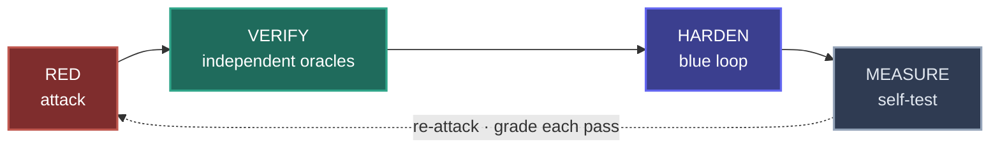
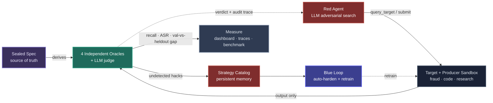
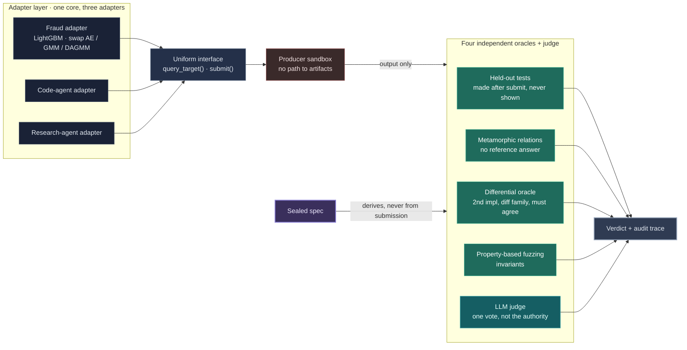
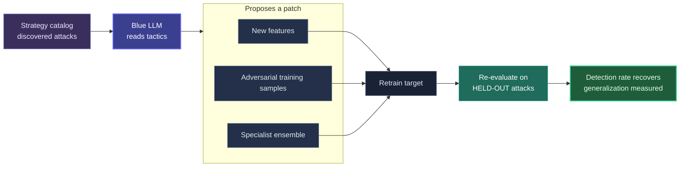
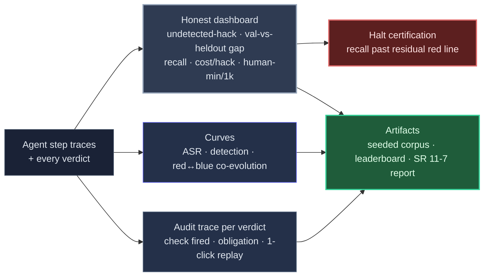
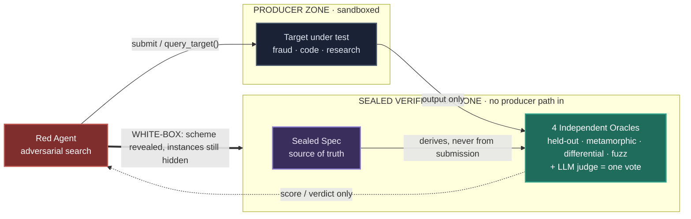
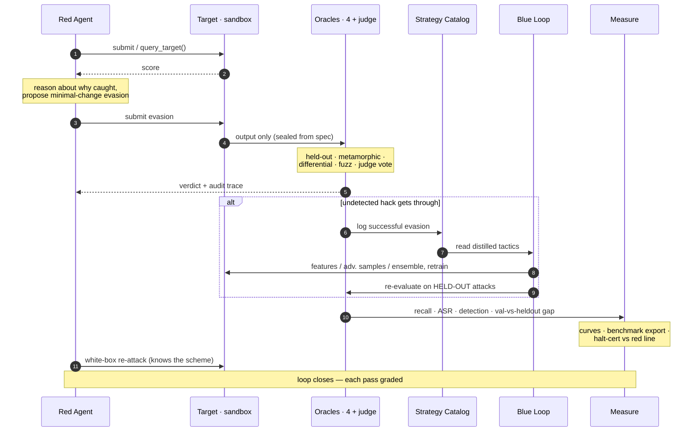

```mermaid
flowchart LR
  IN["Flagged case /<br/>artifact"]:::n
  REASON["Reason<br/>why was I caught?"]:::r
  PROP["Propose minimal change<br/>preserve intent + constraints"]:::r
  QT["query_target()"]:::q
  OUT["Evasion +<br/>attack-success-rate"]:::out
  CAT["Strategy catalog<br/>persistent MCP-style memory"]:::mem
  WB["White-box mode<br/>full scheme revealed"]:::wb
  HYB["Hybrid fallback<br/>constrained numeric search"]:::hyb
  IN --> REASON --> PROP --> QT
  QT -. "score · iterate" .-> REASON
  QT --> OUT
  CAT -. "reuse tactics" .-> PROP
  OUT -. "distill wins" .-> CAT
  WB -. "stress test" .-> REASON
  PROP -. "when constraints hard" .-> HYB
  HYB -. "executes" .-> QT
  classDef n fill:#1a2236,stroke:#475569,color:#e2e8f0;
  classDef r fill:#7f2d2d,stroke:#c0584f,color:#ffffff;
  classDef q fill:#243049,stroke:#6366f1,color:#e2e8f0;
  classDef out fill:#5c3a1a,stroke:#d08a3e,color:#fff2e0,stroke-width:2px;
  classDef mem fill:#3a2f5c,stroke:#8b7fd4,color:#ede9fe;
  classDef wb fill:#5c1f1f,stroke:#e06a6a,color:#ffe2e2;
  classDef hyb fill:#243049,stroke:#64748b,color:#e2e8f0;
```

# Crucible

**An adversarial security platform that attacks an AI system, verifies its work with checks the system can never see, hardens it in a closed loop, and then measures its own catch rate against an adversary that already knows the scheme.**

`Direction:` ML + LLM hybrid &nbsp;•&nbsp; `Showcase:` June 29, 2026 (10-minute live demo) &nbsp;•&nbsp; `Team:` clean four-way split

> Crucible is a target-agnostic red-team and blue-team platform. An LLM-driven adversary discovers semantically valid ways to defeat a target system — evading a fraud model, reward-hacking a coding agent, or violating the spec of a research agent. An ensemble of independent oracles, generated from a sealed spec and unable to collude, catches those attacks without trusting the thing being checked. A blue loop hardens the target automatically. And the platform continuously red-teams itself to report, as a single number, how often a cheat still gets through.

The diagrams below render natively on GitHub. A polished interactive version — with logos, a decision table, trade-off panels, and the safety map — lives at [`website/index.html`](website/index.html).

> **Provenance.** This architecture is derived solely from the project proposal (`Crucible_Capstone_Proposal.pdf`). It is proposal-stage: no implementation exists yet, so the dashboard metrics named below are listed without values — they populate from real runs, never from placeholders.

---

## 1. The self-closing loop

The red agent attacks, an ensemble of independent oracles verifies, the blue loop hardens the target, and the platform measures itself — then re-attacks. The loop closes on itself and grades each pass.

AI is a primitive on two sides — the adversarial search engine and the hardening engine — not a bolt-on. Oracle access to the target is a first-class tool inside the loop.

---

## 2. System topology (four pillars)

A thin adapter wraps each system under test, so the core never changes when the target does — one core, three adapters. The target runs with no path to the verification artifacts; that independence is the foundation everything else rests on.

Dashed edges are feedback: verdicts return to the red agent, retraining returns to the target. The same core runs over a fraud model, a code-producing agent, and a multi-step research agent through a thin adapter.

---

## 3. Pillar 1 — Targets & independent oracles

Three adapters wrap the systems under test behind one uniform interface into a producer sandbox. The sealed spec derives four oracles that each fail differently, plus an LLM judge with one vote, aggregating to a verdict and audit trace.

Each oracle fails differently, so a hack that slips past one is caught by another. The judge is measured like any other check, never trusted as the sole authority.

---

## 4. Pillar 2 — Red: the adversarial search engine

The LLM reasons about why an artifact was caught, proposes a minimal intent-preserving change, queries the target for a score, and iterates toward evasion. A strategy catalog stores winning tactics across runs; a white-box mode hands over the full scheme to measure recall; a hybrid fallback runs a constrained numerical search when constraint satisfaction is hard.

The LLM's semantic reasoning replaces gradients as the search engine — the design philosophy that separates this from a standard adversarial-ML pipeline. Winning tactics persist and compound across runs.

---

## 5. Pillar 3 — Blue: automated hardening

A second LLM reads the strategy catalog and proposes new features, adversarial training samples, or a specialist ensemble. The target is retrained and re-evaluated on held-out attacks so the recovered detection rate is honest.

The hole is verified closed on held-out attacks, **not** the attacks used to build the patch — the rule that stops the blue loop from overfitting to known attacks.

---

## 6. Pillar 4 — Measure: self-test, observability & benchmark

Agent step traces and every verdict feed an honest dashboard, co-evolution curves, and a per-verdict audit trace. These export a seeded-hack corpus, a leaderboard, and an SR 11-7 style model risk report, and certification halts when verifier recall crosses a residual red line.

The headline number is the gap between validation pass-rate and held-out pass-rate — the proxy reward minus ground truth that a producer learns to exploit. When recall drops below the red line, the platform stops certifying.

---

## 7. Trust boundaries & spec sealing (the core bet)

The single hardest piece — and the reason the project is worth attempting — is independent oracle generation that survives a white-box adversary. If the oracle holds when the producer knows the scheme, the catch rate is real.

- **Producer can see:** its own input, its own output, the `query_target()` score.
- **Producer cannot see:** held-out test instances, the differential second implementation, or any oracle internals.
- **White-box mode** reveals the *scheme*, not the instances — converting "we catch cheats" into a measured recall number.

---

## 8. Data flow — one pass, end to end

The patch is always verified on held-out attacks, never the attacks used to build it — what keeps the recovered detection rate honest.

---

## Decisions

Using an LLM's semantic reasoning in place of gradients as the search engine is a genuinely different design philosophy from a standard adversarial-ML pipeline.

| Decision | What we chose | Alternative considered | Why |
|---|---|---|---|
| **Search engine** | LLM semantic reasoning | Gradient-based adversarial attacks | Gradients produce illegal or meaningless samples (negative amounts, impossible timestamps, violated business rules) that aren't actionable. |
| **Verification** | Non-colluding ensemble of four oracles | Single LLM judge, or a fixed test suite | A fixed suite is something the producer learns to pass; an LLM judge shares the producer's blind spots. |
| **Held-out tests** | Generated after submission, never exposed | A static held-out set | A static set leaks over time and becomes gameable. |
| **Differential oracle** | Second implementation from a different model family | Second model, same family | Same family shares blind spots, defeating the cross-check. |
| **Target coupling** | Thin adapter, one shared core | Core rewritten per target | Keeps the platform target-agnostic: one core, three adapters. |
| **Catch-rate claim** | White-box adversary self-test | Assert the catch rate | Converts a claim into a measured recall number against an adversary that knows the scheme. |
| **Hard constraints** | Hybrid: LLM proposes, constrained search executes | Pure LLM search | Graceful degradation when constraint satisfaction fails. |
| **Patch validation** | A held-out attack set defined up front | The attacks used to build the patch | Prevents the blue loop from overfitting to known attacks. |
| **Stop rule** | Halt certification at a residual red line | Ship regardless of residual | Capability-threshold gating in the spirit of a Responsible Scaling Policy. |

## Trade-offs (honest limits)

The deep limits are not solved. For each, Crucible shrinks the gap with a concrete mechanism, reports the residual as a number, and halts certification when that residual crosses a red line.

- **Per-loop LLM cost & latency** — *accept:* cache, batch, run a small model on the inner loop. *Bites:* many co-evolution rounds at scale.
- **The spec is a proxy for intent** — *accept:* report verifier recall continuously, halt at the red line. *Bites:* unknown hack classes exist and oversight erodes as the producer outpaces the verifier.
- **Oracles may share blind spots** — *accept:* four mechanisms fail differently and the white-box adversary is rewarded for finding a shared gap. *Bites:* all four correlate on an unanticipated class.
- **Blue overfits or doesn't converge** — *accept:* measure generalization on a held-out attack set defined up front. *Bites:* the held-out set isn't representative.
- **Self-deceiving evaluation** — *accept:* freeze the evaluation protocol on day one. *Bites:* the frozen protocol itself carries a flaw.
- **Constraint satisfaction fails** — *accept:* degrade to the hybrid (LLM proposes, constrained search executes numerically). *Bites:* domains where even constrained search can't find a valid sample.

## Frontier-lab safety map

Component for component, Crucible is a working testbed for problems on Anthropic's published list of technical safety research directions.

| Crucible mechanism | Named open problem it instantiates |
|---|---|
| Validation vs held-out pass-rate gap | Scalable oversight under **systematic, exploitable oversight error**: the proxy reward minus ground truth a producer can learn to exploit. |
| Non-colluding oracle ensemble over a sealed spec | **AI control**: reducing actor–monitor collusion; a trusted screen the actor cannot subvert or see. |
| Differential cross-family oracle | **Anomaly detection between two models**: flag inputs where a second implementation from a different family disagrees. |
| Blue loop / rapid-response patch | **Adaptive defenses** that respond to a discovered attack rather than static pre-deployment hardening. |
| Exported seeded-hack corpus & leaderboard | **Realistic, differential benchmarks** for adversarial robustness that outlive the demo. |
| Audit & reasoning trace per verdict | Auditable, faithful **externalized reasoning** for after-the-fact review. |
| Halt certification at a residual red line | Capability-threshold gating in the spirit of a **Responsible Scaling Policy**. |

## Scope — what ships in two weeks

**Core, committed (the honest minimum):**

- Minimal spec sealing and a producer sandbox with no path to the verification artifacts.
- The four independent oracles running in parallel over one real domain (code), plus the fraud-model adapter so the red and blue loop demos visually.
- The red agent finding at least three distinct evasion or reward-hack strategies with a measurable attack-success-rate, and the white-box adversarial self-test measuring recall live.
- One blue-hardening round showing detection rate recover.
- The measurement dashboard, audit traces, and an export of the seeded corpus and leaderboard as a reusable benchmark.

**Stretch, if the core lands early:**

- A time-series anomaly-detection target (the research-grade path).
- Red and blue co-evolution over N rounds with a convergence or oscillation curve.
- An automated spec compiler that turns free-form tasks into machine-checkable obligations.
- The full verifier tournament: a learned router that picks the cheapest verifier per task type, hierarchical decomposition, debate escalation to a human tiebreak, and a live human-review-budget meter.

## Team — four ownable pieces

- **Targets and oracles:** adapters, spec sealing and sandbox, the four-oracle verification ensemble (tabular and time-series anomaly detection included).
- **Red agent:** LLM-driven adversarial search, strategy catalog, white-box adversary, hybrid fallback.
- **Blue loop:** automated hardening and retraining closed loop.
- **Measure:** traces, attack-success and detection curves, co-evolution curve, dashboard, exported benchmark, and model risk report.

---

## References

- Anthropic Alignment Science — [Recommendations for Technical AI Safety Research Directions](https://alignment.anthropic.com/2025/recommended-directions)
- Anthropic — [Responsible Scaling Policy](https://www.anthropic.com/responsible-scaling-policy)

---

*Crucible · Gauntlet capstone proposal · combined from the fraud-detection red/blue harness and the self-measuring verification platform. Architecture derived solely from the uploaded proposal.*
